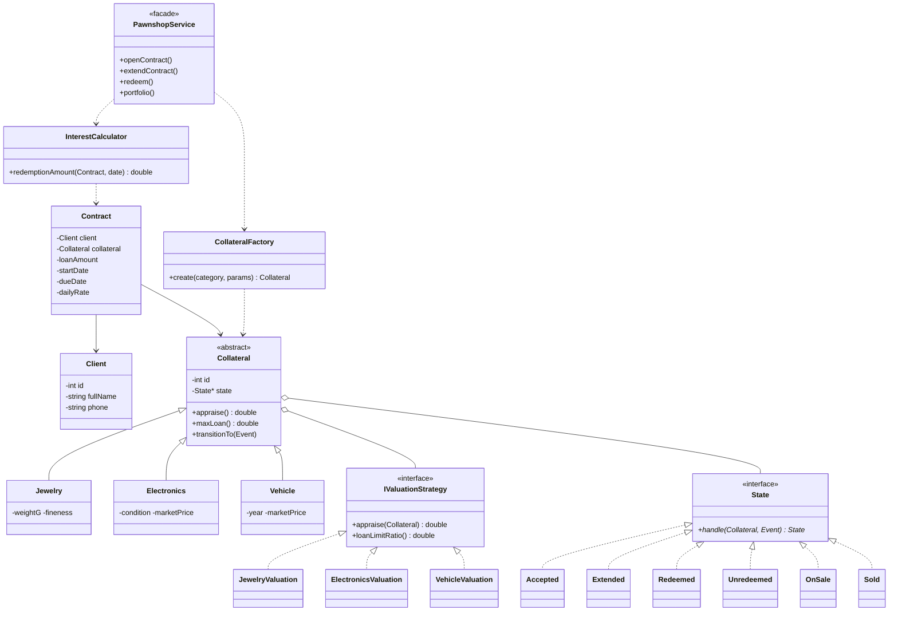

# Діаграма класів

```mermaid
classDiagram
    class Client {
        -int id
        -string fullName
        -string phone
    }
    class Collateral {
        <<abstract>>
        -int id
        -State* state
        +appraise() double
        +maxLoan() double
        +transitionTo(Event)
    }
    class Jewelry { -weightG -fineness }
    class Electronics { -condition -marketPrice }
    class Vehicle { -year -marketPrice }
    class IValuationStrategy {
        <<interface>>
        +appraise(Collateral) double
        +loanLimitRatio() double
    }
    class JewelryValuation
    class ElectronicsValuation
    class VehicleValuation
    class CollateralFactory {
        +create(category, params) Collateral
    }
    class State {
        <<interface>>
        +handle(Collateral, Event) State*
    }
    class Accepted
    class Extended
    class Redeemed
    class Unredeemed
    class OnSale
    class Sold
    class Contract {
        -Client client
        -Collateral collateral
        -loanAmount
        -startDate
        -dueDate
        -dailyRate
    }
    class InterestCalculator {
        +redemptionAmount(Contract, date) double
    }
    class PawnshopService {
        <<facade>>
        +openContract()
        +extendContract()
        +redeem()
        +portfolio()
    }

    Collateral <|-- Jewelry
    Collateral <|-- Electronics
    Collateral <|-- Vehicle
    IValuationStrategy <|.. JewelryValuation
    IValuationStrategy <|.. ElectronicsValuation
    IValuationStrategy <|.. VehicleValuation
    Collateral o-- IValuationStrategy
    Collateral o-- State
    State <|.. Accepted
    State <|.. Extended
    State <|.. Redeemed
    State <|.. Unredeemed
    State <|.. OnSale
    State <|.. Sold
    CollateralFactory ..> Collateral
    Contract --> Client
    Contract --> Collateral
    InterestCalculator ..> Contract
    PawnshopService ..> CollateralFactory
    PawnshopService ..> InterestCalculator
```